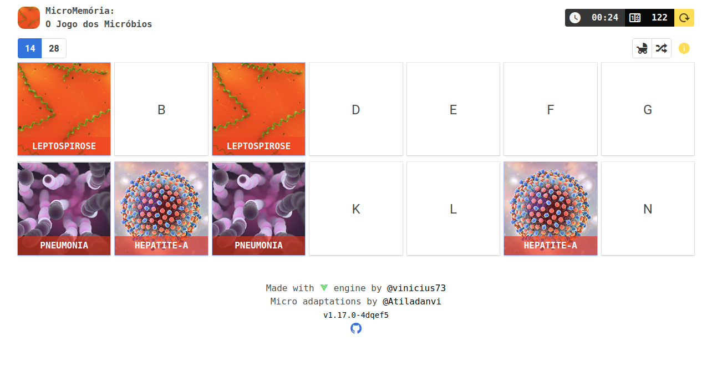

# Micro-Memory Game

A simple memory game using microbes.

[](https://app.netlify.com/sites/micro-memoria/deploys)



## Resources used

- [Vue.js (PWA)](https://vuejs.org)
- [Buefy](https://buefy.org/)
- [Bulma CSS](https://bulma.io/)
- [Material Design Icons](https://materialdesignicons.com/)

## Commands

```sh
yarn install // install deps
yarn run serve // serve app http://localhost:8080
yarn run build // build app
```
